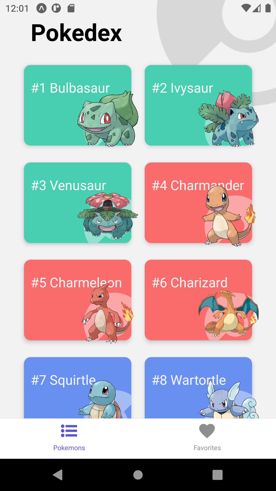
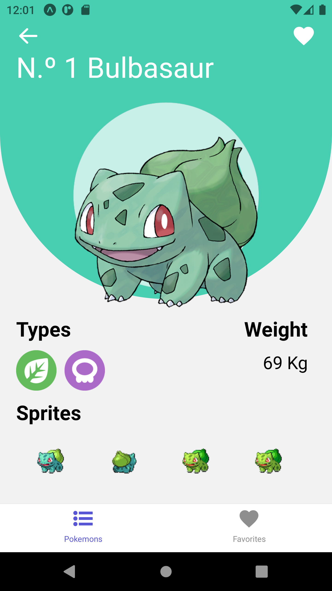
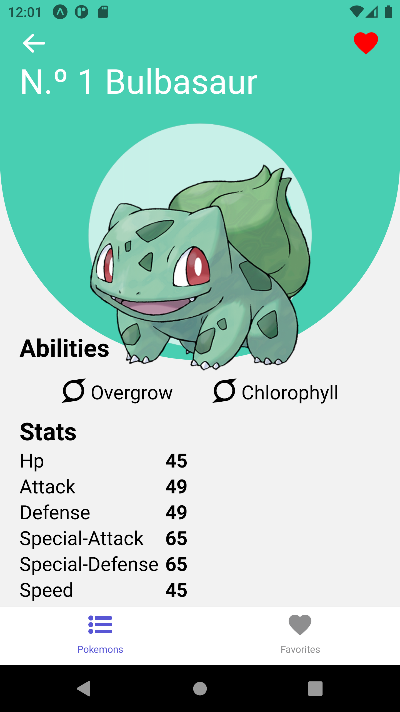
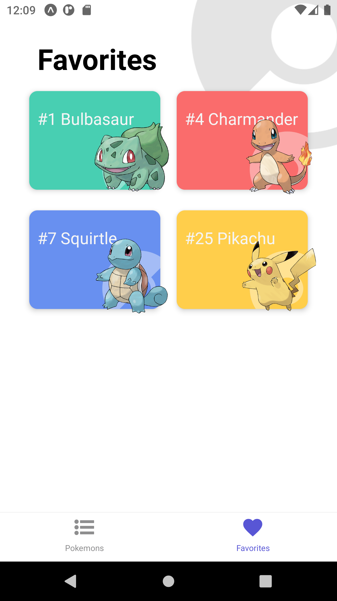

# PokedexReactNative 📱


## Description

Pokedex_ReactNative is a simple Pokedex application developed using React Native and Expo. It provides information about various Pokémon, including details such as types, abilities, and statistics. It also includes a "Favorite" feature that allows you to add your most liked pokemons to the Favorite Screen, so you can always remember them !

## Features

- List all existing Pokemons.
- Pokémon Details screen, with comprehensive details for each Pokémon.
- Intuitive and user-friendly interface.
- Favorite page were you can find your selected Pokemons !

## ScreenShots







## Prerequisites

Make sure to have Node.js, Android Studio and npm installed before running the application.

## Instalación
```bash
git clone https://github.com/ManukBASS/PokedexReactNative.git
cd PokedexReactNative
npm install
npm start
a (on the Expo menu, for connecting the app with your virtual device)
